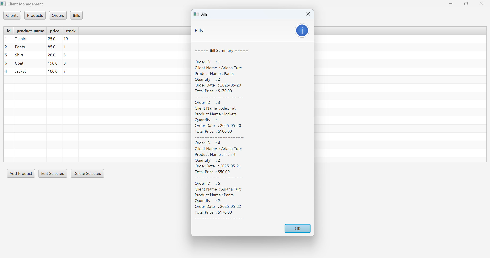

# 🧾 Orders Management Application (Java, OOP, JDBC, JavaFX)

##  Overview
This project is an **Orders Management Application** built in Java for the **Fundamental Programming Techniques** course (2025, Technical University of Cluj-Napoca).  
It follows a **layered architecture** pattern, using relational databases to store **Clients**, **Products**, **Orders** and **Bills**, and a GUI interface for user interaction.  

The application ensures **data integrity**, **validation**, and **logging** while allowing users to manage orders efficiently.

---

##  Features

### Client Operations
- Add new clients
- Edit existing clients
- Delete clients (cascade deletes orders & bills)
- View all clients in a table (JTable)

### Product Operations
- Add new products
- Edit existing products
- Delete products (cascade deletes orders & bills)
- View all products in a table (JTable)

### Order Operations
- Place orders by selecting an existing product and client
- Validate stock availability; display under-stock warning if necessary
- Automatic stock decrement after order confirmation
- Logging of all orders with total price

### Additional Features
- **Data Validation**:  
  - Client age 
  - Client email format  
- **Reflection-based table population**: dynamically generates JTable headers from object fields
- **JavaDoc documentation** for all classes

---

##  Project Structure

### Layers
- **Model Layer (`dataModel`)**: Classes representing entities: `Client`, `Product`, `Orders`, `Bill`
- **Data Access Layer (`dataAccess`)**: DAO classes using JDBC & reflection for CRUD operations
- **Business Logic Layer (`businessLogic`)**: Validates and manages operations for clients, products, and orders
- **Presentation Layer (`ui`)**: Swing GUI for user interaction

### Business Logic Layer (BLL)
Handles validation and business rules for each entity:

- **ClientBLL** – Manages client-related operations (CRUD) and applies validation rules for age and email.  
- **ProductBLL** – Manages product-related operations and ensures stock and pricing rules.  
- **OrderBLL** – Handles order creation, quantity checks, and total price calculation.  
- **LogBLL** – Handles billing, order logging, and report generation.  

### Data Access Layer (DAO)
Handles database interactions using the DAO pattern:

- **AbstractDAO<T>** – Generic DAO providing CRUD operations with reflection-based mapping.  
- **ClientDAO** – Implements `AbstractDAO` for `Client`.  
- **ProductDAO** – Implements `AbstractDAO` for `Product`.  
- **OrderDAO** – Implements `AbstractDAO` for `Orders`.  
- **BillDAO** – Implements `AbstractDAO` for `Bill`.  
- **ConnectionFactory** – Provides JDBC connections and manages connection pooling.

### Validators
Ensure data integrity before database operations:

- **ClientAgeValidator** – Ensures client age is within valid range.
- **EmailValidator** – Validates email format.  
- **QuantityValidator** – Checks ordered quantity against available stock.

---

##  Tech Stack
- **Language**: Java (OOP, layered architecture)
- **GUI**: JavaFX (`JFrame`, `JTable`)
- **Database**: PostgreSQL (Client, Product, Orders, Log tables)
- **Persistence**: JDBC
- **Validation & Logging**: Java validation + `Bill` logging table

---
## 📷 GUI Preview

Here is a screenshot of the application’s interface:

